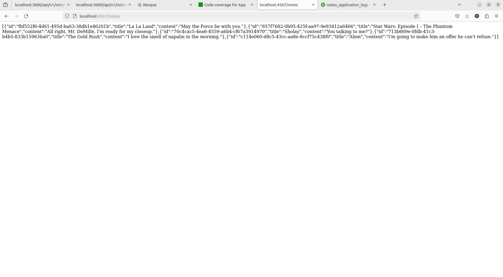

# Notes
***

- [Overview](#overview)
    - [Built With](#built-with)
    - [Structure](#structure)
- [Installation](#installation)
    - [Prerequisites](#prerequisites)
    - [Setup](#setup)
    - [Useful commands](#useful-commands)
- [Result](#result)
    - [Steps to check results](#steps-to-check-results)

## Overview

### Built with

Notes project uses such technologies:
- Ruby 3.2
- Rails 7.1
- Sinatra 4.0
- Node 20
- MySQL 8.0
- MongoDB 7.0
- Redis 7.2
- Mongo Express 1.0
- resque, resque-scheduler 
- Docker 
- Docker Compose
- Makefile

### Structure

Project consists from 9 services:

1. `web`

Ruby / Ruby on Rails simplified backend service for a note-taking application.
It can retrieve notes from other notes service called `externalnotes`.

2. `externalnotes`

Ruby / Sinatra simplified backend service that has one endpoint to show the latest notes.
It always return a list of notes.
It does not use any storage service, it just generate fake note using gem `faker` and returns them in json.

3. `notesconsumer`

Node.js service used as consumer of `web` service.
It has curl scripts and Node.js scripts to demonstrate how a separate service could consume `web` service.

4. `db`

MySQL database used as storage of data for `web` service.

5. `worker`

Service for background job processing. It used gem `resque`.

6. `scheduler`

Service for background job scheduling system.
It uses gem `resque-scheduler`.

7. `redis`

Data store used by `worker` service.

8. `mongodb`

MongoDB database used for storing logs of all API requests `web` service.

9. `mongodb-ui`

MongoDB admin interface that helps to visually check data from MongoDb database, 
view records, query records for monitoring or debugging purposes.

10. `apidocumentation`

API documentation for Notes API.

## Installation

### Prerequisites

The following  must be installed:
- **docker**              (must docker 25 or newer)
- **docker compose**      (must be docker compose v2  [Check more in detail](https://docs.docker.com/compose/migrate/)) 
- **git**
- **make**

### Setup

1.  To download the project, use `git clone`

***
All the following commands use inside the root project directory
***

2.  Create necessary configuration for project setup:

```bash
cp .env.example .env
cp -r docker/.env.example/ docker/.env
```

3. Start docker services, using the command:
 ```bash
make up 
```
Check in other terminal that services started.
```bash
docker compose ps
```
An output similar to the following is expected:
```bash
NAME                       IMAGE                    COMMAND                  SERVICE            CREATED          STATUS          PORTS
mongodb                    mongo:7.0                "docker-entrypoint.s…"   mongodb            19 seconds ago   Up 17 seconds   0.0.0.0:27017->27017/tcp, :::27017->27017/tcp
notes-apidocumentation-1   notes-apidocumentation   "/docker/entrypoints…"   apidocumentation   19 seconds ago   Up 17 seconds   0.0.0.0:8080->8080/tcp, :::8080->8080/tcp
notes-db-1                 notes-db                 "docker-entrypoint.s…"   db                 19 seconds ago   Up 17 seconds   0.0.0.0:3306->3306/tcp, :::3306->3306/tcp, 33060/tcp
notes-externalnotes-1      notes-externalnotes      "/docker/entrypoints…"   externalnotes      19 seconds ago   Up 17 seconds   0.0.0.0:4567->4567/tcp, :::4567->4567/tcp
notes-mongodb-ui-1         mongo-express:1.0.2      "/sbin/tini -- /dock…"   mongodb-ui         19 seconds ago   Up 17 seconds   0.0.0.0:8081->8081/tcp, :::8081->8081/tcp
notes-notesconsumer-1      notes-notesconsumer      "docker-entrypoint.s…"   notesconsumer      19 seconds ago   Up 17 seconds   
notes-redis-1              redis:7.2                "docker-entrypoint.s…"   redis              19 seconds ago   Up 17 seconds   0.0.0.0:6379->6379/tcp, :::6379->6379/tcp
notes-scheduler-1          notes-scheduler          "/docker/entrypoints…"   scheduler          18 seconds ago   Up 16 seconds   
notes-web-1                notes-web                "/docker/entrypoints…"   web                19 seconds ago   Up 17 seconds   0.0.0.0:3000->3000/tcp, :::3000->3000/tcp
notes-worker-1             notes-worker             "/docker/entrypoints…"   worker             18 seconds ago   Up 16 seconds   0.0.0.0:8000->8000/tcp, :::8000->8000/tcp
```

5. Run database migrations:
```bash
make dbmigrate
``` 
6. To seed the database, run the following command:
```bash
make dbseed
``` 

### Useful commands

To run Rspec tests, run the following command:
```bash
make rspec
```

To run RSpec tests and generate test coverage, run the following command:
```bash
make rspec-coverage
```

## Result

### Steps to check results

1. Visit the following url http://localhost:3000/api/v1/notes/


Rails application works

2. Visit the following url http://localhost:8000/stats/resque

Background job processing works


3. Visit the following url http://localhost:4567/notes

External service used for retrieving notes works



4. Visit the following url http://localhost:8081/db/notes_logs_db/notes_application_logs

Credentials are admin, pass

Storing logs to MongoDB works


5. Visit the following url http://localhost:8080

Notes API documentation works


6. Test coverage 92%


